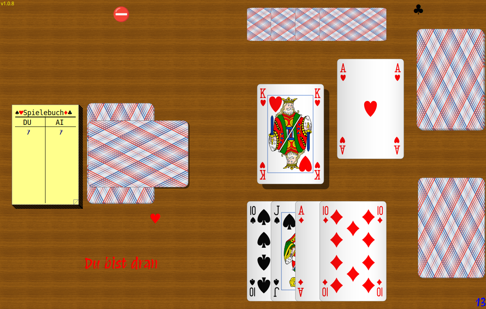

# FLTK Schnapsen

Schnapsen is an implementation of the popular (Austrian) card game ["Schnapsen"](https://en.wikipedia.org/wiki/Schnapsen) for [FLTK](https://www.fltk.org/).
You play against the computer.

It is developed for Linux, but should theoretically run also on Windows or macOS.
It is running fine with `wine` under Linux.

## Dependencies

Only FLTK version 1.4 or higher.

When the [`miniaudio.h`](https://miniaud.io/) include file is present (load it with `make fetch-miniaudio`), it will use sound output.

## Build

Basically just uses `fltk-config` to build.
Makefile or CMakeLists.txt are supplied.
Uses C++ standard 20!

## Running the program

Just run from its folder or - under Linux - use the `install.sh` script to place it in local user directories.

The program can use German or English as its language. It uses the system "locale" to see if it can use German, otherwise it switches to English.

You can run it fullscreen by pressing `F10`. It will memorize that in it's config file `fltk-schnapsen.cfg`.

See all the options when running from the console with argument `-h`.

## Game control

Fetch the card you want to play by clicking on it, then move it (without mouse button pressed) to the center of the "table" and click again to play it.
If you re-consider your decision while still moving the card click the right button to return it into your hand.

Use the mouse to declare a "marriage" by dragging your queen in your hand over the corresponding king and click to announce (and play).

Drag the matching Jack in your hand over the trump card under the card deck and click to "grab" the trump card.

Click on the deck to "close" the game.

Click on the gameboard to see the last 10 match results.

Press `F1` to see the "About" screen which also displays the statistics summary of all played games.

Press `F8` to select the card style.

Move the mouse over your played pack to see the tricks. You can also see the first trick of the computer by hoovering the mouse over its pack.

Other keys:

	`t`	Sort cards by trump
	`a`	Change animation level
	`v`	Change sound volume (Use with `Ctrl` to lower volume)
	`+`	Increase card scale
	`-`	Decrease card scale
	`0`	Reset card scale to 1.

## The game

This is an implementation of the 20 cards variant (without the nine card), that is most common in Austria or Bavaria.
You play a match from 7 points down to zero and each player receives 5 cards at the begin.
Single game wins/losses count 1 to 3 points depending on the final score. The first who reaches 0 wins the match and the oppenent receives the "bummerl".

The computer player (AI) of course *does not* use any "illegal" knowledge of the players hand, it just
uses the available hints (cards already played, or not played).

See: [Schnapsen card game on Wikipedia](https://en.wikipedia.org/wiki/Schnapsen)

**NOTE:** There is one rule I probably implemented somewhat different, than used elsewhere: When the game
is "closed down" by one of the players, it must be played till the last card and only the
score of the player, who closed is taken into account (it must suffice). If the other player
reaches 66 meanwhile this is irrelevant. Maybe I will change that in the future or make it optional.

You can flip through the 10 last played match results by clicking on the game book.

You can see game/match statistics on the welcome screen (or by pressing `F1`).

## UI Configuration

The look can be customized to some extent using the mouse or the keyboard.

- Clicking on the background of the play card area, when there is no card there will allow
  to select a background tile for the table.

- Clicking on the player message will allow to select a custom font.

- Pressing `F8` brings up a cardset/cardback selector, where you can click to select the
  cardset and/or card backside.

- Holding down the `Ctrl` key during start of the program resets the configuration to the default.

You can supply your own cardsets or card backsides, by adding the required directories and files in the
`rsc` subdirectory. You can also use `.png` files instead of `.svg` format.

**NOTE**: Some options (like setting language) are currently available only by command line (or by editing the .cfg file manually).

## Status

Practically finished. Will receive only bugfixes or occasional improvements.

Game flow and graphics are complete, configuration via UI lacks some options (see above).

Game play of the AI is at least comparable to my own play, so that's the limit ;)
Schnapsen is highly dependent on card luck, so you have to play many games to
outweight this and use your chances cleverly.

## Varia

The game uses licence free SVG card images from various sources, in particular from:

[SVG playing cards](https://commons.wikimedia.org/wiki/Category:SVG_playing_cards)
